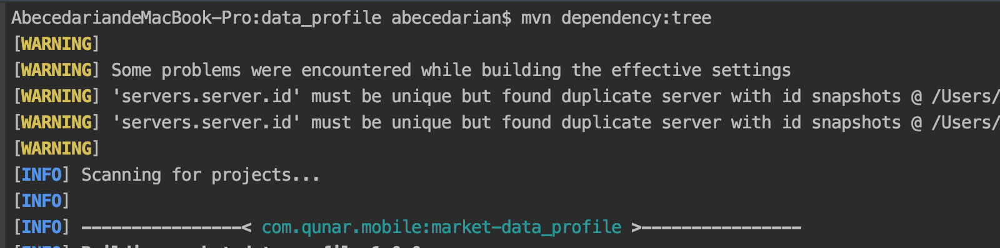
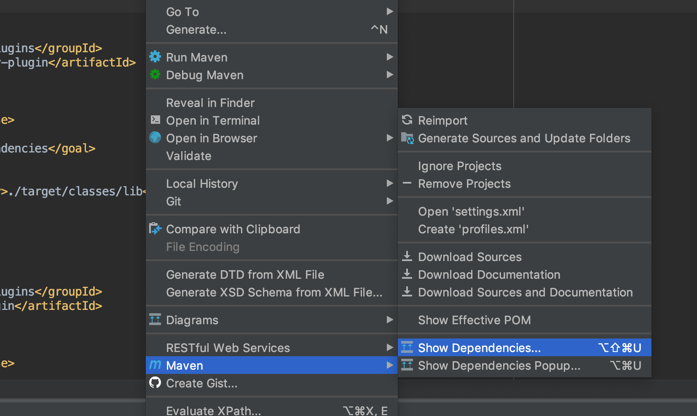
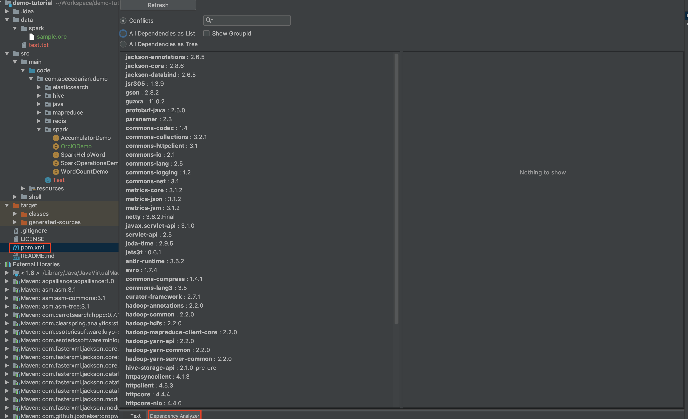

#### Maven常见问题

##### 依赖包冲突问题

- 冲突定位：
    - 方式1:使用mvn dependency:tree 
    
    
    - 方式2:使用show dependencies
    
    
    - 方式3:使用Maven Helper插件
    
     
- 冲突解决：
    > 在引用的包中加入exclusion,排除相关依赖
    ````
    <dependency>
        <groupId>com.alibaba</groupId>
        <artifactId>dubbo</artifactId>
        <version>2.5.3</version>
        <exclusions>
            <exclusion>
                <!-- 排除org.springframework依赖 -->
                <artifactId>spring</artifactId>
                <groupId>org.springframework</groupId>  
            </exclusion>
        </exclusions>
    </dependency>
    ````

##### 执行包与运行平台依赖冲突问题

- 冲突描述:
    > 例如spark程序在本地调试一切正常，打包后交程序提交到yarn(spark on yarn)上运行出现以下异常
    ````
    java.lang.NoSuchMethodError: org.apache.hadoop.hive.ql.exec.vector.VectorizedRowBatch.getDataColumnCount()I
    ````
    > 运行平台出现 **java.lang.NoSuchMethodError** 异常,但本地运行没问题,异常根源是依赖冲突,这是考虑两个方面
    > - 打包时依赖冲突 (解决方案参考依赖包冲突问题)
    > - 执行包与运行平台的依赖冲突

- 冲突解决:
    > 打包时将冲突的依赖重命名,在执行时避免调用平台的依赖而冲突
    ````
    <plugin>
        <groupId>org.apache.maven.plugins</groupId>
        <artifactId>maven-shade-plugin</artifactId>
        <version>2.4.3</version>
        <executions>
            <execution>
                <phase>package</phase>
                <goals>
                    <goal>shade</goal>
                </goals>
            </execution>
        </executions>
        <configuration>
            <relocations>
                <relocation>
                    <pattern>org.apache.hadoop.hive.ql.exec</pattern>  <!-- 原始类名 -->
                    <shadedPattern>org.shade.hadoop.hive.ql.exec</shadedPattern><!--  打包后替换的类名,避免在平台运行时依赖冲突 -->
                </relocation>
            </relocations>
    
            <shadedArtifactAttached>true</shadedArtifactAttached>
            <shadedClassifierName>jar-with-dependencies</shadedClassifierName>  <!-- 包后缀名 -->
        </configuration>
    </plugin>
    ````

